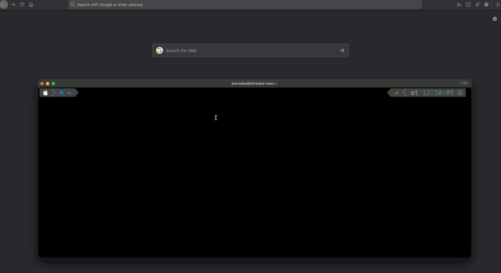

# presentation-demo-app
Spring-boot 2 🚀 + Thymeleaf ☘️ containerised application for demo purposes

## Motivation 💡

I was looking for a simple monolithic application with CRUD ability, file upload with a nice user interface. Unfortunately there was no simple modular application as such I could find on github. So I decided to develop this application which has least dependencies. 

## Demo 📺



## How to run 🏃

### As a container

```
podman run -it -p 8080:8080 quay.io/jnirosha/presentation-demo-app
```

or 

```
docker run -it -p 8080:8080 quay.io/jnirosha/presentation-demo-app
```

visit ➙ [http://localhost:8080](http://localhost:8080)

### As a developer

You know it, don't you? 

In case you were vacation for 6months, here are the steps:

- Make sure you've installed Java 11 and apache maven 3.8+
- `git clone https://github.com/JudeNiroshan/presentation-demo-app.git`
-  `mvn spring-boot:run`

visit ➙ [http://localhost:8080](http://localhost:8080)

## Contributions 🤝

Contributions are most welcome! Please make sure any changes you do, the intention of this application to work as expected where there is ❌ **no internet access**(unless you explictly integrate external services)
